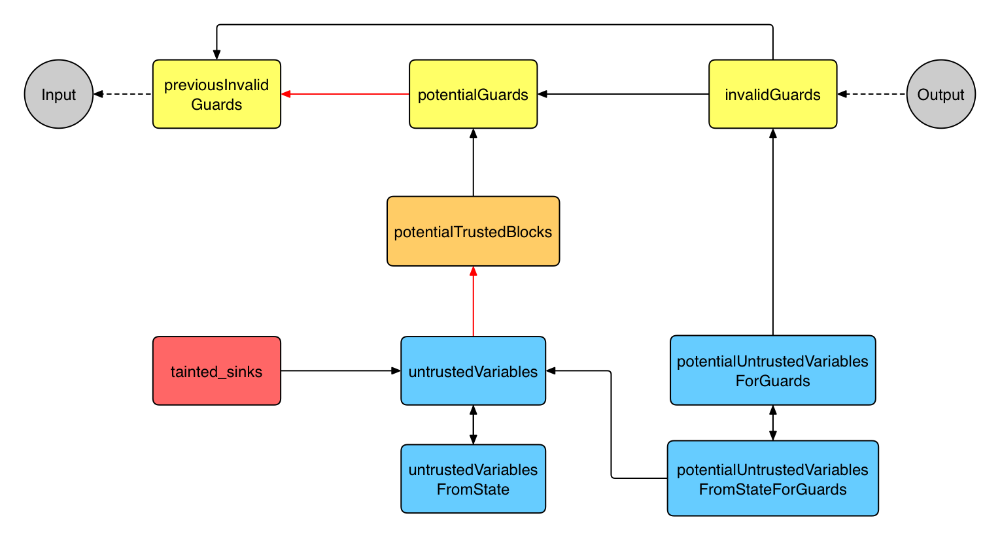

# Static Taint Analysis for Ethereum Contracts

## Introduction
The goal of this project is to implement a static taint analyzer for Ethereum smart contracts. The analyzer takes as input an Ethereum smart contract written in Solidity and outputs whether an untrusted user can benefit from the contract by exploiting `selfdestruct`. The vulnerabilities that are supposedly covered by this analyzer are described in this [specification](resources/pass2022-project-description.pdf). 


We have designed our analyzer using the architecture shown in the flowchart below. In the [report](resources/report.pdf), we explain each block of the flowchart and how they are linked. Each block represents a Datalog relation, but keep in mind that not all relations are shown on this flowchart. It has been simplified to show only the blocks that are conceptually important. A black arrow pointing from block A to block B means that block A is defined using block B. If the arrow is red, it is a negated relation.



This project was carried out in pairs as part of the "[Program Analysis for System Security and Reliability](http://www.vvz.ethz.ch/lerneinheitPre.do?semkez=2022S&lerneinheitId=159153&lang=en)" course at ETH Zürich.

## Repository Structure
* The `peck` directory contains a parser that transforms a Solidity contract into an intermediate representation (IR), and derives Datalog facts that encode the contract’s IR. You must not edit any files in this folder..
* The `project` directory contains the code template for your project. Technical details on the IR and its representation in Datalog can be found in `project/README-IR.md`. The `project/test_contracts` directory contains example test contracts with annotated ground truth in comments. The `project/analyze.dl` and `project/analyze.py` are the main source files for the analysis.

## Setup Instructions
The project requires executables `python 3.9`, [`solc 0.5.7`](https://github.com/ethereum/solidity/tree/v0.5.7) and [`souffle 1.5.1`](https://github.com/souffle-lang/souffle/tree/1.5.1). You will also need libraries [`py-solc`](https://github.com/ethereum/py-solc) and [`graphviz`](https://gitlab.com/graphviz/graphviz/). We provide a dockerfile for an easy setup of the dependencies.
```
docker build . -t analyzer
docker run -it analyzer
```
You can follow the instructions in the dockerfile to install the dependencies locally.

## Example Usage

Try it out:
```
$ cd project
$ python analyze.py test_contracts/1.sol
Tainted
```

You can also inspect the contract’s control flow graph / Datalog representation:
```
$ python analyze.py --visualize test_contracts/1.sol
$ ls test_contract_out 
facts.pdf  graph.pdf
```

## Results
Below are the results on 75 private tests (3 of them have timeout after one minute, and are not categorized below):

| Truth   | Guess   | Number of tests |
|---------|---------|-----------------|
| Safe    | Safe    | 28              |
| Tainted | Tainted | 33              |
| Safe    | Tainted | 6               |
| Tainted | Safe    | 5               |

This gives an overall **success probability of 85%** for the analyzer. 